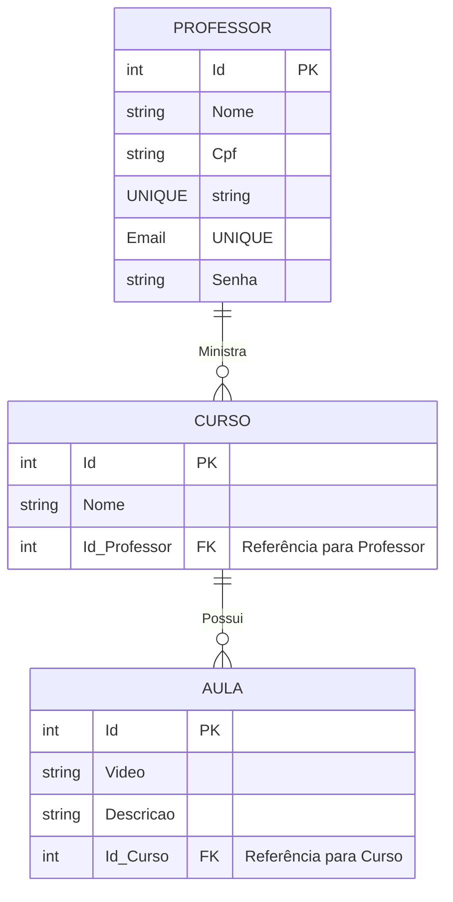

# **Trabalho Prático de Desenvolvimento de Software para Persistência usando ORM e Fastify**

## 📌 **Objetivo**

O objetivo deste trabalho é desenvolver uma aplicação para gerenciar **cursos, aulas e professores** utilizando a tecnologia Fastify como framework para criação de uma API REST e Prisma ORM para persistência de dados. A aplicação deve permitir a **criação, leitura, atualização e exclusão** de registros no banco de dados, garantindo a integridade e consistência das informações.

## 🎯 **Descrição**

A aplicação será um sistema de gerenciamento de **mini cursos**, onde:

- Cada **professor** pode ministrar **vários cursos**;
- Cada **curso** pode ter **várias aulas** associadas;
- As informações de **professores, cursos e aulas** devem ser armazenadas e gerenciadas através da API.

A API REST deve seguir boas práticas de desenvolvimento, utilizando **Fastify** para a criação das rotas e **Prisma ORM** para a comunicação com o banco de dados.

## 📜 **Requisitos de Entrega do Trabalho Prático**

### 1️⃣ **Modelagem do Banco de Dados**

Criar um modelo de dados que atenda à descrição acima, contendo as seguintes entidades:

#### **Entidades e Atributos**

- **Professor**

  - `Id` (Identificador único, chave primária)
  - `Nome` (Nome completo)
  - `Cpf` (Cadastro de Pessoa Física, único)
  - `Email` (Endereço de e-mail, único)
  - `Senha` (Senha para autenticação)

- **Curso**

  - `Id` (Identificador único, chave primária)
  - `Nome` (Nome do curso)
  - `Id_Professor` (Relação com a tabela **Professor**, identificando o responsável pelo curso)

- **Aula**
  - `Id` (Identificador único, chave primária)
  - `Video` (URL ou referência para o vídeo da aula)
  - `Descrição` (Texto com detalhes sobre o conteúdo da aula)
  - `Id_Curso` (Relação com a tabela **Curso**)

#### **Relacionamentos**

- **Um professor pode ministrar vários cursos**, mas cada curso tem **apenas um professor**.
- **Um curso pode ter várias aulas**, mas cada aula pertence a **apenas um curso**.

### 2️⃣ **Implementação da API REST**

Desenvolver uma API REST para gerenciar os dados, garantindo as seguintes funcionalidades:

#### **Endpoints**

✅ **Professor**

- Criar um professor (`POST /professores`)
- Listar todos os professores (`GET /professores`)
- Buscar um professor pelo ID (`GET /professores/:id`)
- Atualizar dados de um professor (`PUT /professores/:id`)
- Excluir um professor (`DELETE /professores/:id`)

✅ **Curso**

- Criar um curso (`POST /cursos`)
- Listar todos os cursos (`GET /cursos`)
- Buscar um curso pelo ID (`GET /cursos/:id`)
- Atualizar um curso (`PUT /cursos/:id`)
- Excluir um curso (`DELETE /cursos/:id`)

✅ **Aula**

- Criar uma aula (`POST /aulas`)
- Listar todas as aulas (`GET /aulas`)
- Buscar uma aula pelo ID (`GET /aulas/:id`)
- Atualizar uma aula (`PUT /aulas/:id`)
- Excluir uma aula (`DELETE /aulas/:id`)

### 3️⃣ **Tecnologias Utilizadas**

- **Node.js** com **Fastify** para criação da API
- **Prisma ORM** para comunicação com o banco de dados
- **Banco de dados relacional** (PostgreSQL ou MySQL)
- **Postman ou Insomnia** para testes de API

## 🔍 **Diagrama do Modelo de Dados**

